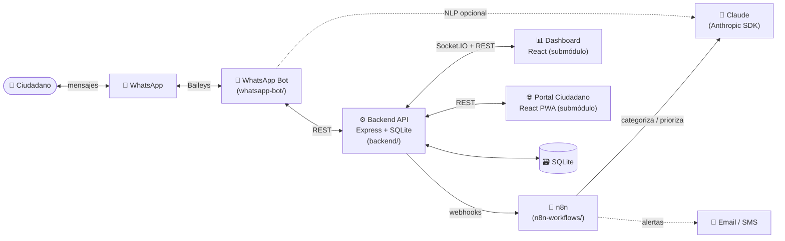

<div align="center">

# 🏛️ CatemuConecta

### Participación ciudadana municipal por WhatsApp, potenciada con IA

Sistema integral que conecta a los vecinos de **Catemu** con su municipalidad: reportar problemas urbanos, responder encuestas y consultar servicios desde un bot de WhatsApp, con categorización automática mediante IA (Claude) y un panel de gestión en tiempo real.


</div>

> 🏆 Desarrollado para el hackathon **"Municipios a la VanguardIA 2025"** (Ministerio Secretaría General de Gobierno, Chile), en colaboración con la **Municipalidad de Catemu**.

---

## 📋 Tabla de contenidos

- [¿Qué es?](#-qué-es)
- [Características](#-características)
- [Arquitectura](#-arquitectura)
- [Stack tecnológico](#-stack-tecnológico)
- [Estructura del repositorio](#-estructura-del-repositorio)
- [Puesta en marcha](#-puesta-en-marcha)
- [Variables de entorno](#-variables-de-entorno)
- [Despliegue con PM2](#-despliegue-con-pm2)
- [Workflows de n8n](#-workflows-de-n8n)
- [Seguridad](#-seguridad)
- [Documentación](#-documentación)
- [Licencia](#-licencia)

---

## 🎯 ¿Qué es?

**CatemuConecta** acerca la gestión municipal a la ciudadanía a través del canal que ya usan todos: WhatsApp. Un vecino escribe al bot, reporta un bache o una luminaria caída (opcionalmente con foto y ubicación), y el sistema:

1. Registra el reporte en la **API backend** (Express + SQLite) generando un ticket de seguimiento.
2. Lo envía a **n8n**, que usa **Claude** para categorizarlo y asignarle prioridad automáticamente.
3. Lo expone en un **dashboard municipal** en tiempo real para que cada departamento lo gestione.
4. Notifica al ciudadano el avance de su ticket.

Además gestiona **encuestas ciudadanas** dinámicas con resultados agregados.

## 🌟 Características

### 📱 Bot de WhatsApp
- Reportes ciudadanos (baches, luminarias, basura, etc.) con foto y ubicación.
- Encuestas conversacionales con resultados en tiempo real.
- Información municipal 24/7 (horarios, contactos, servicios).
- **Modo seguro** (`SAFE_MODE`) que restringe el bot a números de prueba mientras se desarrolla.

### 📊 Dashboard municipal
- Estadísticas y métricas actualizadas en vivo (Socket.IO).
- Gestión de tickets con estados y priorización.
- Análisis de encuestas y mapa de incidencias geolocalizadas.

### 🌐 Portal web ciudadano (PWA)
- Reportes con carga de imágenes y seguimiento de tickets.
- Diseño responsive, pensado para móvil.

### 🤖 IA y automatización
- Categorización y priorización de reportes con **Claude** vía workflows de **n8n**.
- Exportación de reportes a **PDF** y **Excel**.

## 🏗 Arquitectura



**Flujo de un reporte:** WhatsApp → Bot (Baileys) → Backend (crea ticket en SQLite) → webhook a n8n → Claude categoriza/prioriza → backend actualiza el ticket → Dashboard lo muestra en tiempo real → el ciudadano recibe el número de ticket.

> ℹ️ El backend incluye dos servidores: `backend/server.js` (base, el que arranca `ecosystem.config.js`) y `backend/server-enhanced.js`, que añade **Socket.IO**, **Helmet** y **rate limiting**. Los frontends `dashboard/` (panel municipal) y `web-app/` (portal ciudadano PWA) se mantienen en **repositorios separados** y no forman parte de este checkout.

## 🧰 Stack tecnológico

| Capa | Tecnologías |
|------|-------------|
| **Backend** | Node.js, Express, SQLite3, Multer, Socket.IO, Helmet, express-rate-limit, ExcelJS, PDFKit, validator, xss, Axios |
| **WhatsApp Bot** | `@whiskeysockets/baileys`, `@anthropic-ai/sdk` (Claude), qrcode-terminal, pino, node-cache, sharp |
| **Frontend** | React 18, Chart.js, Leaflet, PWA *(repos separados: `dashboard/`, `web-app/`)* |
| **Automatización / IA** | n8n, Claude (Anthropic) |
| **Operación** | PM2 (`ecosystem.config.js`), QR generator |

## 📁 Estructura del repositorio

```
conecta_catemu/
├── backend/              # API REST + lógica de negocio (Express + SQLite)
│   ├── server.js         # Servidor base
│   ├── server-enhanced.js# Variante con Socket.IO, Helmet y rate limiting
│   ├── database.js       # Acceso a SQLite
│   ├── routes/           # Rutas (gestión del bot, etc.)
│   ├── services/         # IA, gamificación, sockets
│   └── surveys-data.js   # Definición de encuestas
├── whatsapp-bot/         # Bot de WhatsApp (Baileys + Claude)
│   ├── index.js          # Punto de entrada
│   ├── handlers/         # Manejo de mensajes y respuestas
│   ├── services/         # Cliente API, integración Anthropic
│   └── config/           # security.js (modo seguro, números de prueba)
├── n8n-workflows/        # Workflows de automatización con IA (JSON)
├── qr-generator/         # Generador de códigos QR
# dashboard/  -> Panel municipal — React (repo separado, no incluido)
# web-app/    -> Portal ciudadano PWA — React (repo separado, no incluido)
├── DOCUMENTACION-COMPLETA/ # Documentación extendida
├── ecosystem.config.js   # Configuración de PM2
└── .env.example          # Plantilla de variables de entorno
```

## 🚀 Puesta en marcha

### Requisitos
- Node.js 18+
- npm
- (Opcional) n8n para la categorización con IA
- (Opcional) Una API key de Anthropic para las funciones de IA

### Instalación

```bash
git clone --recurse-submodules https://github.com/jnrivra/conecta_catemu.git
cd conecta_catemu

# Backend
cd backend && npm install && cd ..

# Bot de WhatsApp
cd whatsapp-bot && npm install && cd ..

# Frontends (submódulos)
cd dashboard && npm install && cd ..
cd web-app  && npm install && cd ..
```

> Si ya clonaste sin submódulos: `git submodule update --init --recursive`.

### Configuración

```bash
cp .env.example .env
# Edita .env con tus valores (ver la sección Variables de entorno)
```

### Ejecución (modo desarrollo)

```bash
# Terminal 1 — Backend (http://localhost:3001)
cd backend && npm start

# Terminal 2 — Portal ciudadano (http://localhost:3000)
cd web-app && npm start

# Terminal 3 — Dashboard municipal (http://localhost:3002)
cd dashboard && npm start

# Terminal 4 — Bot de WhatsApp (escanea el QR que aparece en consola)
cd whatsapp-bot && npm start
```

La primera vez, el bot mostrará un **código QR** en la terminal: escanéalo desde *WhatsApp → Dispositivos vinculados* para iniciar sesión.

## 🔐 Variables de entorno

Usa [`.env.example`](.env.example) como plantilla. Las más relevantes:

| Variable | Descripción |
|----------|-------------|
| `PORT` | Puerto del backend (por defecto `3001`) |
| `DATABASE_PATH` | Ruta de la base SQLite |
| `JWT_SECRET` | Secreto para firmar tokens (genera uno aleatorio) |
| `ANTHROPIC_API_KEY` | API key de Claude (opcional, para IA) |
| `BOT_PHONE_NUMBER` | Número del bot, sin `+` |
| `N8N_WEBHOOK_URL` | URL base de los webhooks de n8n |
| `RATE_LIMIT_MAX` / `RATE_LIMIT_WINDOW` | Límite de peticiones |

> ⚠️ **Nunca** subas tu archivo `.env`, ni copias de respaldo (`.env.bak`), ni las credenciales de sesión de WhatsApp (`whatsapp-bot/sessions/`). El `.gitignore` ya las excluye.

## 🟢 Despliegue con PM2

El archivo [`ecosystem.config.js`](ecosystem.config.js) define los procesos `catconecta-backend`, `catconecta-webapp` y `catconecta-dashboard`:

```bash
npm install -g pm2
pm2 start ecosystem.config.js              # desarrollo
pm2 start ecosystem.config.js --env production
pm2 status
pm2 logs
```

## 🔀 Workflows de n8n

Los workflows de [`n8n-workflows/`](n8n-workflows/) categorizan y priorizan los reportes con Claude y disparan alertas. Consulta [`n8n-workflows/README.md`](n8n-workflows/README.md) para importarlos y configurarlos. Resumen:

```bash
npm install -g n8n && n8n start   # http://localhost:5678
```

1. *Workflows → Import from File* → selecciona el JSON.
2. Configura la credencial de Claude (Header Auth `x-api-key`).
3. Apunta `N8N_WEBHOOK_URL` del backend a `http://localhost:5678/webhook`.

## 🔒 Seguridad

- **Modo seguro del bot** (`SAFE_MODE`): limita las respuestas a `TEST_NUMBERS` durante el desarrollo.
- **Backend endurecido** (`server-enhanced.js`): Helmet, rate limiting, sanitización (`validator`, `xss`).
- **Secretos fuera de git**: `.env*` y los directorios de sesión de WhatsApp están en `.gitignore`. Las sesiones de Baileys (`creds.json`, pre-keys) son credenciales sensibles equivalentes a iniciar sesión en la cuenta: trátalas como secretos.

## 📚 Documentación

| Documento | Contenido |
|-----------|-----------|
| [`DOCUMENTACION-COMPLETA/INDICE-COMPLETO.md`](DOCUMENTACION-COMPLETA/INDICE-COMPLETO.md) | Índice maestro de toda la documentación |
| [`DOCUMENTACION-COMPLETA/RESUMEN-EJECUTIVO.md`](DOCUMENTACION-COMPLETA/RESUMEN-EJECUTIVO.md) | Resumen ejecutivo del proyecto |
| [`DOCUMENTACION-COMPLETA/QUICK-REFERENCE.md`](DOCUMENTACION-COMPLETA/QUICK-REFERENCE.md) | Referencia rápida de comandos |
| [`SISTEMA-COMPLETO.md`](SISTEMA-COMPLETO.md) | Visión general del sistema completo |
| [`README-COMPLETO.md`](README-COMPLETO.md) | Guía detallada de instalación y uso |
| [`FLUJO-BOT-MEJORADO.md`](FLUJO-BOT-MEJORADO.md) | Flujo conversacional del bot |
| [`GUIA-RAPIDA-BOT.md`](GUIA-RAPIDA-BOT.md) | Guía rápida del bot |
| [`DASHBOARD-MEJORADO.md`](DASHBOARD-MEJORADO.md) | Detalles del dashboard |
| [`ESTADO-SISTEMA.md`](ESTADO-SISTEMA.md) | Estado de los componentes |
| [`DEMO.md`](DEMO.md) | Guion de demostración |
| [`n8n-workflows/README.md`](n8n-workflows/README.md) | Configuración de los workflows de n8n |

## 👥 Equipo

- **Juan Enrique Rivera Olivares** — Líder técnico y arquitectura de software.
- **Municipalidad de Catemu** — Validación y colaboración.

## 📝 Licencia

Distribuido bajo licencia **MIT**. Consulta [`LICENSE`](LICENSE).

---

<div align="center">

**Hecho con ❤️ para mejorar la vida de los vecinos de Catemu**
*Hackathon "Municipios a la VanguardIA" — 2025*

</div>
